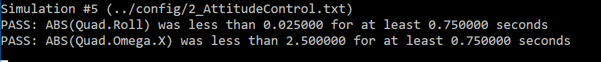
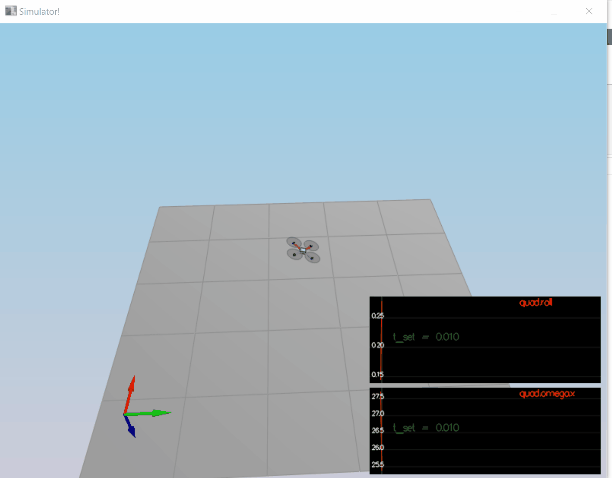
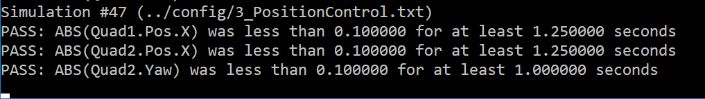
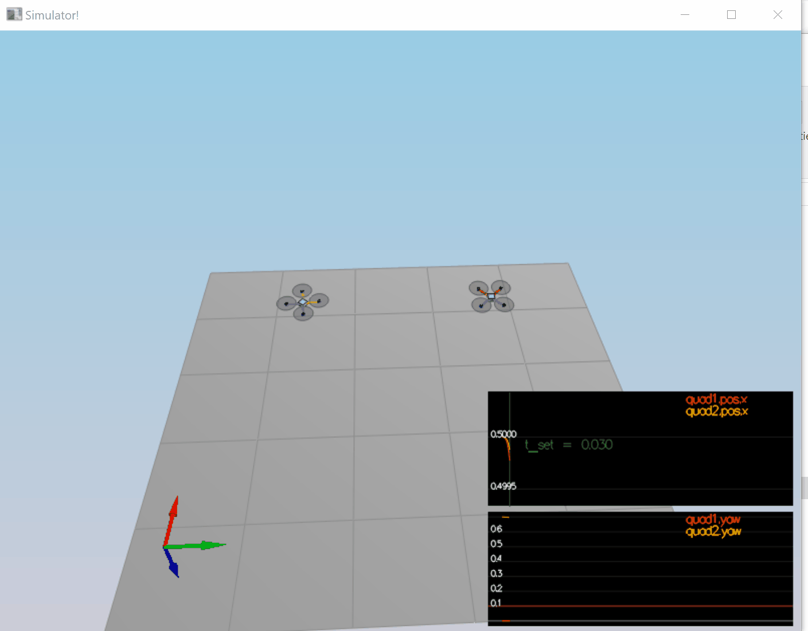
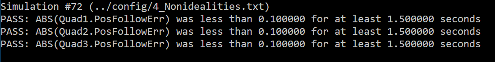
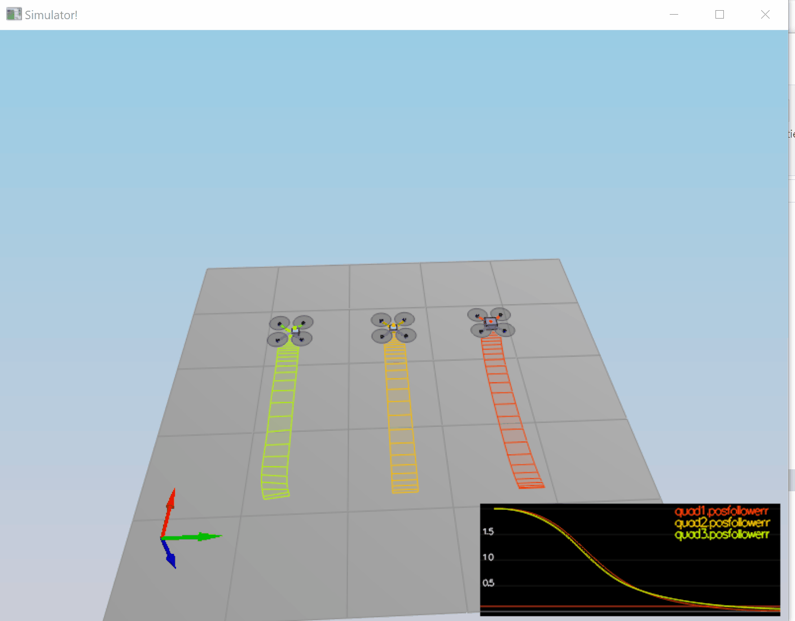
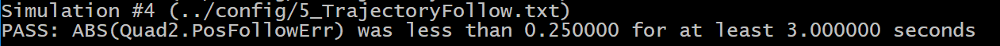
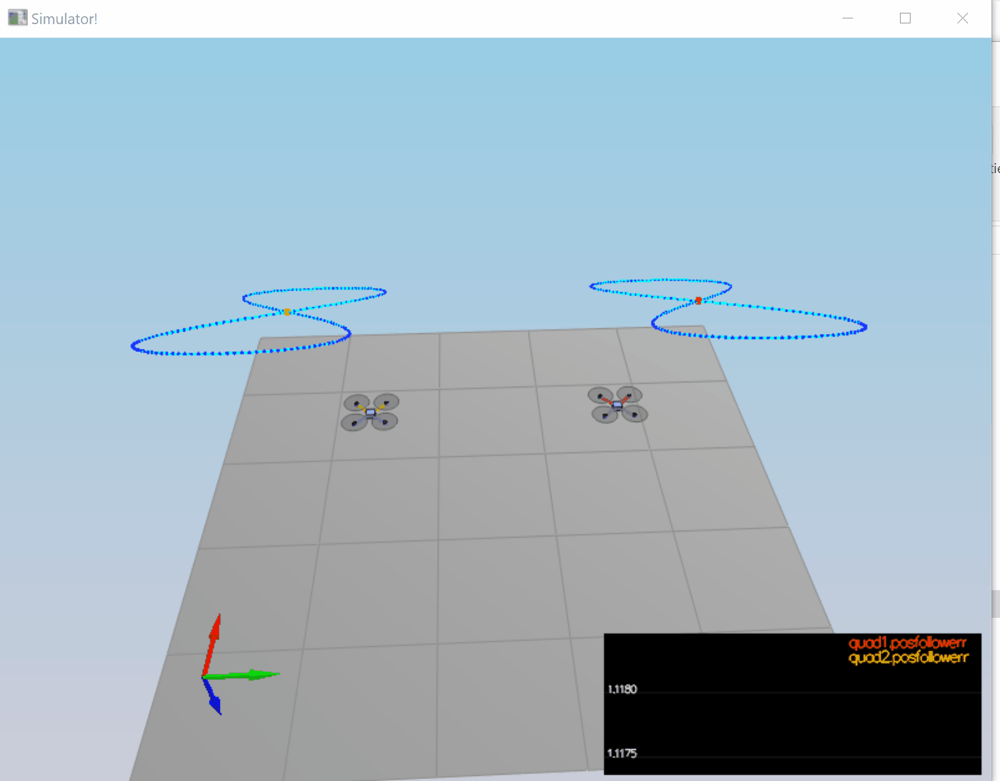

# C++ Controller Solution
## David Howard
##  dmh2000@gmail.com

# Udacity Flying Car Nanodegree - Controls Project
https://confirm.udacity.com/PTFQRS24

## Flight Evaluation

### Scenario 1 - Intro
The goal of this scenario was to modify the mass value of the vehicle
so that it held altitude. The original value was .4 kilograms, and
the value .495 passed the test. 

The file config/QuadControlParams-S1.txt has the gains that passed
the tests in this scenario.

### Scenario 2 - Attitude Control
The goal of this scenario was to implement the GenerateMotorCommands,
BodyRateControl and RollPitchControl functions. Following that,
it was required to tune the kpPQR and kpBank values so the vehicle roll was
stabilized.

This was the second most difficult scenario to implement correctly. The
BodyRateControl function was easy, as it followed exactly from the
lesson. The RollPitchControl was also straighforward, as it
followed the lessons. The difficult part was the GenerateMotorCommnands, 
as it deviated a bit from the projects in the lesson. It was
clear that unless this function was implemented properly, nothing
would work. It wasn't clear to me from the lessons that the motor commands were a relative simple
modification of the  set_propeller_angular_velocities function
from the exercises. Once I resolved the differences in implementation
the scenario began to pass. I required several iterations of 

Tuning of kpPQR was straigtforward. I simply doubled the initial value (23) and twiddled it a little
and the test passed. The kpPQR gains that worked were relatively low compared to what was needed later. 
The test passed with kpPQR = 42,42,15. This threw off my tuning for scenario 3 because I didn't know yet that it needed to be much higher.

The file config/QuadControlParams-S2 has the gains that passed the test in this
scenario. The gif recorder cut off the final frames that showed the success green bars but test was passing.


<p></p>


### Scenario 3 - Position Control
The goal of this scenario was to implement the  AltitudeControl, LateralPositionControl
and YawControl functions. Then it was required to tune the kpPosXY, kpPosZ, kpVelXY, and
kpVelZ parameters so that the 3 quads in the test scenario arrived at the respective
target positions within the error limits. 

The altitude control followed the exercise on a feedfoward controller along with the lesson on PID control for
adding the integrator value. The lateral position controller and yaw controller were also straighforward. No constraints
were implemented yet. 

Tuning of the parameters took several hours to pass the test. 

The file config/QuadControlParams-S3.txt has the gains that passed the test in this scenario.


<p></p>

### Scenario 4 - Non-Idealities
The goal of this scenario was to tune the existing parameters to have the 3 quads fly to their respective
target position within the error and time limits. 

No changes to the code were required at this point. Quad 2, the 'normal' quad worked as is
with the existing parameters. Quad 1 with the offset CG failed the test because it stopped with an 
small offset from the target position. There is no integrator in the LatertalController that would
help correct this. After iterating the gains, it was found that increasing the kpPQR gains would move the 
stop position towards the target point. These gains were increased until they were about 4X the original values
and the test passed. Quad 3 with the dip in Z position was failing the test because it would overshoot
the target and then move back, exceeding the time limit. Per the instruction an integrator was added to 
the AltitudeController. After some gain changes, the quad would stop under the target position and then
the integrator would correct its position, but too slowly so the time limit was still exceeded. Finally
some balancing LateralController gains and the Z integrator gain resulted in the test passing. At this
point all three tests passed.

The file config/QuadControlParams-S4 has the gains that passed the test in this
scenario.


<p></p>


### Scenario 5 - TrajectoryFollowing
The goal of this scenario was to control two quads flying a figure eight trajectory. Despite the fact
that all the previous tests were passing, when this scenario was run the quads would greatly overshoot
and fly crazy patterns and sometimes crash. After some iteration of the gains there was no improvement
so the original gains from scenario 4 were reset. The resulting flight pattern indicated that angle and
velocity limits were probably being exceeded. At this point the code had not had the
constraints on angles and velocity implemented, so they were added to the code. The angle limits
were placed on the motor commands, the roll-pitch targets, the Z-dot term, the velocity and acceleration commands,
using the CONSTRAIN macro. This improved the flights but they were not passing yet. After some reasearch
it was found that the velocity command limit should be placed on the total velocity command rather than the 
individual X and Y components. That was changed and again the flight improved but did not pass. The
constraint on the acceleration commands in the LateralController were removed and the flights passed.

The file config/QuadControlParams.txt has the gains that passed the tests in all scenarios.


<p></p>

## Implementation Notes
Following are excerpts of the controller implementations.

### GenerateMotorCommands
A couple of changes from the previous Python excercises were that the inputs were moment commands
instead of rates. The multiplication by Inn was done prior to this function so it was removed.
The 'kappa' term was equivalent to the 'k_m' term from the Python excercises. This caused some confusion
in the slack channel because it was not pointed out in the project notes so it wasn't clear where to use
kappa. The omega[n] squared terms were the resulting motor commands. A 'k_f' term was added in case
it mattered but it did not. The project notes were vague on how to go from the properller rate commands
in the Python exercises to motor commands. It took some research on the slack channel to get clarification. 

A different solution was also implemented that used the linear equation of torques and forces to generate
the motor commands. A version of that is included in the code, controlled by an #ifdef macro. Testing
showed that these two solutions were equivalent.
```
float c_bar = collThrustCmd;
float p_bar = momentCmd.x / len;
float q_bar = momentCmd.y / len;
float r_bar = -momentCmd.z / kappa; -- kappa == k_m from the lessons

// my solution to the linear equations. it differed a bit from the provided
// Python solution but was equivalent.
omega[0] = (c_bar + p_bar + q_bar + r_bar) / 4.0f;
omega[1] = (c_bar + q_bar - 2 * omega[0]) / 2.0f;
omega[2] = (c_bar + r_bar - 2 * omega[0]) / 2.0f;
omega[3] = (c_bar + p_bar - 2 * omega[0]) / 2.0f;

f[0] = k_f * omega[0];
f[1] = k_f * omega[1];
f[2] = k_f * omega[2];
f[3] = k_f * omega[3];
```
References:
 - Feed-Forward Parameter Identification for Precise Periodic Quadrocopter Motions (paper)
 - Python exercises and lessons
 - Hints from previous cohorts (slack)

### Body Rate Controller Implementation
This implementation followed the Python excercises, in vector form, but
with the multiplication by the moment of inertia in this function rather then
the GenerateMotorCommands.
```
V3F I(Ixx, Iyy, Izz);
momentCmd = kpPQR * (pqrCmd - pqr) * I;
```
References:
 - Python exercises and lessons

### Roll-Pitch Controller Implementation
This implementation followed the Python exercises, with the addition of
the tilt constraints on the target commands.
```
b_x_c_target = accelCmd.x / c;
b_x_c_actual = R(0, 2);
b_x_c_target = CONSTRAIN(b_x_c_target, -maxTiltAngle, maxTiltAngle);
b_x_c_dot = kpBank * (b_x_c_target - b_x_c_actual);


b_y_c_target = accelCmd.y / c;
b_y_c_actual = R(1, 2);
b_y_c_target = CONSTRAIN(b_y_c_target, -maxTiltAngle, maxTiltAngle);
b_y_c_dot = kpBank * (b_y_c_target - b_y_c_actual);

pqrCmd.x = (b_x_c_dot * R(1, 0) - b_y_c_dot * R(0, 0)) / R(2, 2);
pqrCmd.y = (b_x_c_dot * R(1, 1) - b_y_c_dot * R(0, 1)) / R(2, 2);
pqrCmd.z = 0;
```
References:
- Python exercises and lessons

### Altitude Controller Implementation
This implementation followed the Python exercises, with the addition of the constraint
on the computed z_dot term, and the addition of the integrator.
```
// compute the desired z_dot_limited
z_err = posZCmd - posZ;
z_dot_limited = (z_err * kpPosZ) + velZCmd;
z_dot_limited = CONSTRAIN(z_dot_limited, -maxAscentRate, maxDescentRate);

// position term
z_err_dot = velZCmd - velZ;

// integrator
integratedAltitudeError += z_err * dt;

// u_1_bar term
u_1_bar =( kpPosZ * z_err) + (kpVelZ * z_err_dot) + (KiPosZ * integratedAltitudeError) + accelZCmd;

// collective acceleration
c = (u_1_bar - G) / R(2, 2);

// convert to force (F=MA) with UP = +
thrust = -1.0f * (mass * c);
```
References:
 - Python excercise and lesson
 - Integrator from 2D lesson
  
### Lateral Position Controller Implementation
This implementation followed the Python exercises with the addition
of the constraint on the XY velocity command. A limit on the computed
acceleration command was tried but the results were worse so it was removed.
The XY velocity command limit was not covered in the lessons so at first
it was implemented separately on X and Y but that had poor reseults. The proper
method was noted in the slack channel comments. That implementation worked.

```
// limit overall xy velocity command 
norm = velCmd.magXY();
if (norm > maxSpeedXY) {
	velCmd *= maxSpeedXY / norm;
}

// compute x term
x_err = posCmd.x - pos.x;
x_err_dot = velCmd.x - vel.x;
accelCmd.x = (kpPosXY * x_err) + (kpVelXY * x_err_dot) + accelCmdFF.x;

// compute y term
y_err = posCmd.y - pos.y;
y_err_dot = velCmd.y - vel.y;
accelCmd.y = (kpPosXY * y_err) + (kpVelXY * y_err_dot) + accelCmdFF.y;

// limiting the accelaration command made the trajectory following worse so it is removed
// no z component
accelCmd.z = 0.0f;
```

### Yaw Controller Implementation
This implementation followed the Python exercise with the addition
of the limitation on the yaw command. The "Math/Angles.h" file 
including the normalization function that was applied to yaw terms. 
```
yawCmd = fmod(yawCmd, 2.0f * F_PI);

yawCmd = AngleNormF(yawCmd);
yaw = AngleNormF(yaw);
yawRateCmd = kpYaw * (yawCmd - yaw);
```

## Conclusion
Approximately 30 hours were spent on this project. Most of the time was spent
on the following activities, in increasing order.
- Code changes (constraints) for scenario 5
- Understanding how to implement GenerateMotorCommands, due to the subtle differences from the Python exercise.
- Parameter tuning for scenario 4
- Initial parameter tuning for scenario 3

As expected, gain tuning took the most time. Scenario 5 passed the tests, but the initial entry path taken
by the quads wasn't ideal. Some time was spent attempting to improve that, but without success.

